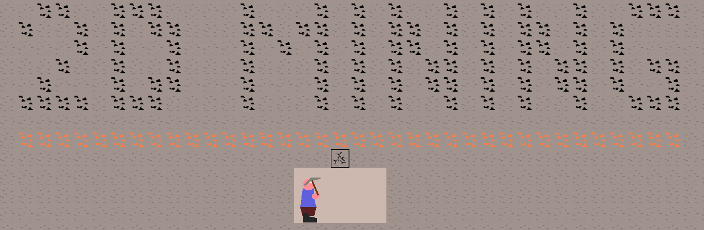
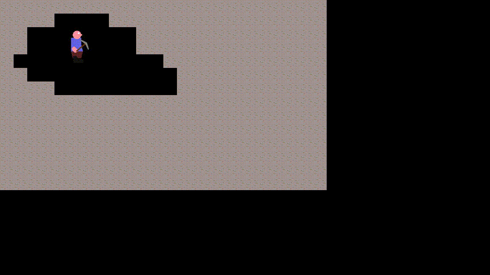

2D Mining Sandbox ( Godot )
=============

 * [About](#about)
 * [Controls](#controls)
 * [How To Contribute](#contribute)

About
------

Gameplay (V3)
------

Controls:
------

| Action                        | Key(s)               |
|---------                      | -------------        |
|Move|W/A/S/D|
|Jump|Space|
|Use Weapon/Tool|Left Mouse Button|
|Secondary Hand Action|Right Mouse Button|
|Next/Prev Hotbar item|Mouse Wheel or Q/E|
|Drop item|X|
|Interact|F|
|Toggle Inventory|Tab|
|Toggle Build Menu|B / Middle Mouse Button|
|Rotate Block|F|
|Toggle free camera|K|

Cheats ( if enabled ):
	
| Cheat                        | Key              |
|---------                      | -------------        |
|Toggle fly|F1|

Contribute
------

